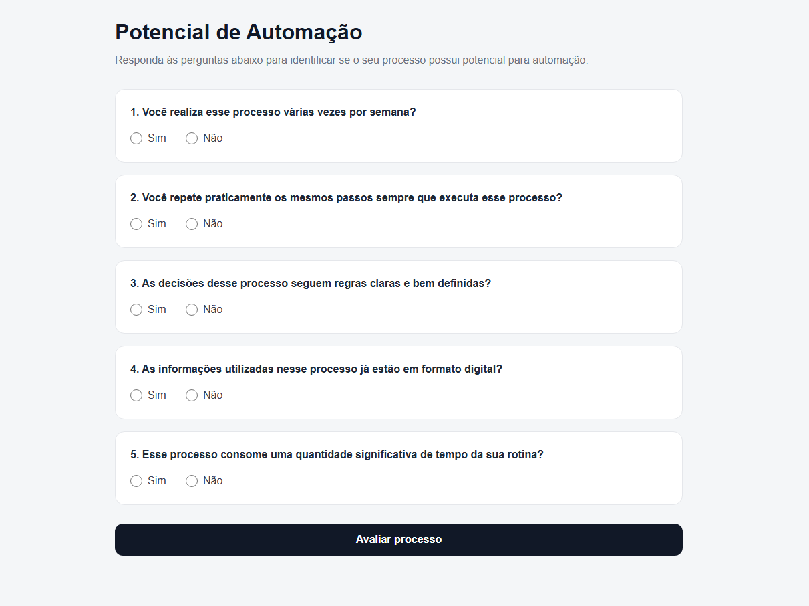
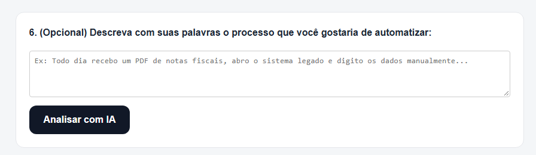
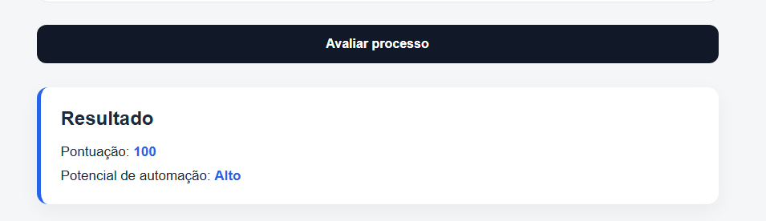

# Potencial de Automação

Aplicação web simples para identificar se um processo possui potencial para automação.

O usuário responde algumas perguntas sobre o processo e a aplicação calcula uma pontuação, retornando o nível de potencial de automação.

Foi adicionada uma análise complementar utilizando IA generativa, consumida através da API do Google Gemini.

O usuário pode descrever livremente o processo no campo de análise, e essas informações são enviadas para a API para que o Gemini identifique possíveis oportunidades de automação.

## Preview

### Formulário

### Resultado

## Tecnologias

- Python
- Flask
- JavaScript
- HTML
- CSS
- Docker
- Gunicorn

## Como executar

### Clone o projeto

git clone 

### Suba a aplicação com Docker:
docker compose up --build

### Acesse: 
http://localhost:5000

### Funcionamento

O formulário envia as respostas para a API:

POST /api/avaliar

O backend calcula a pontuação e retorna o resultado em JSON.
